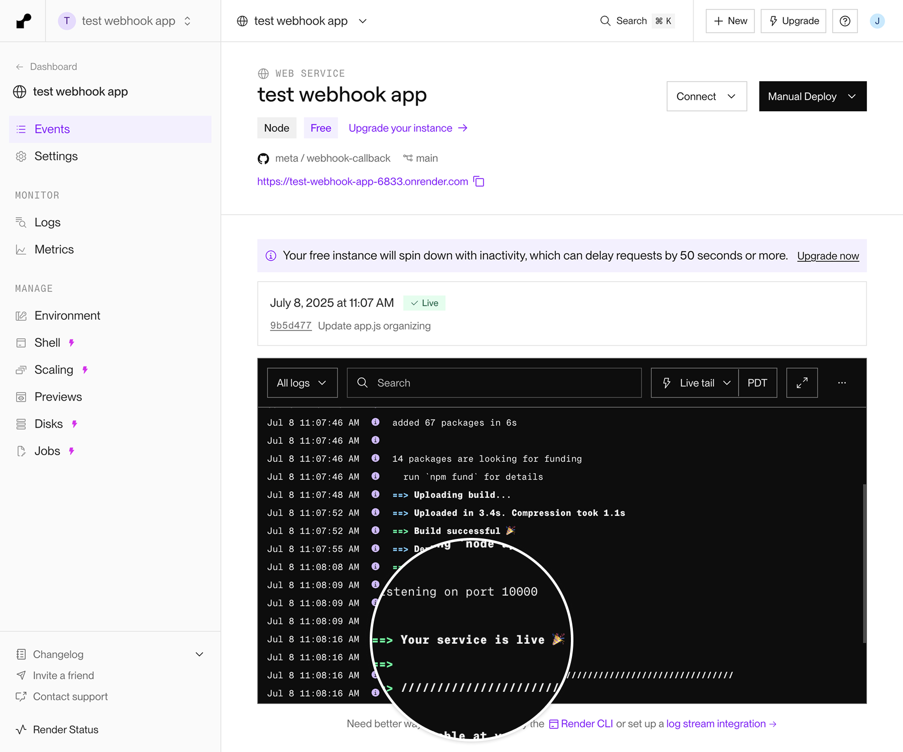
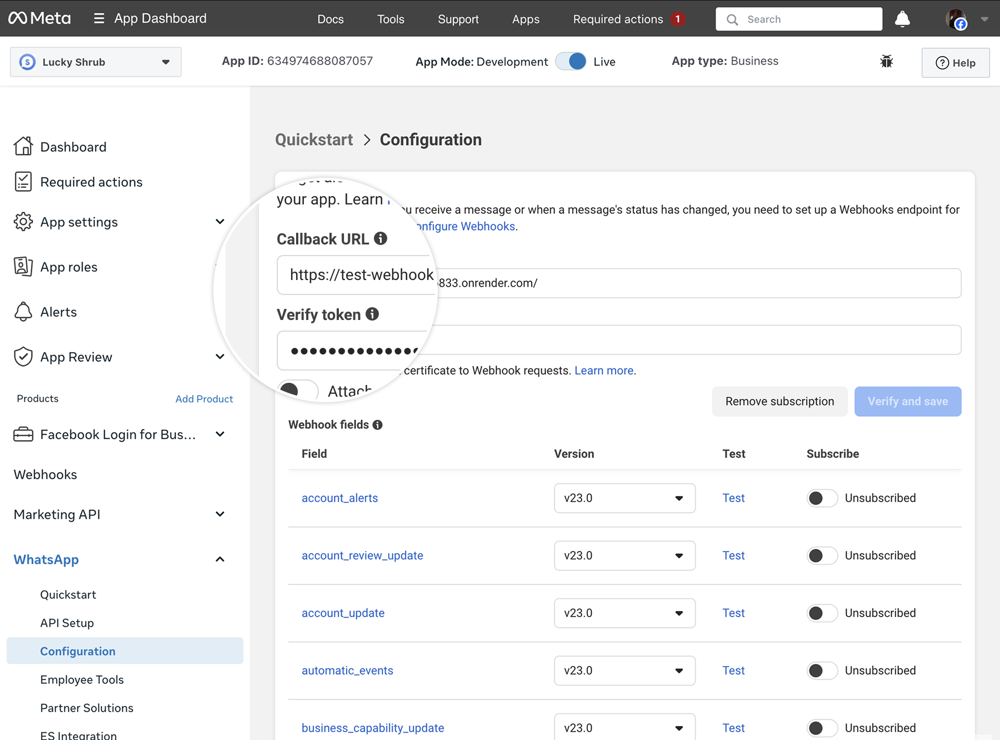
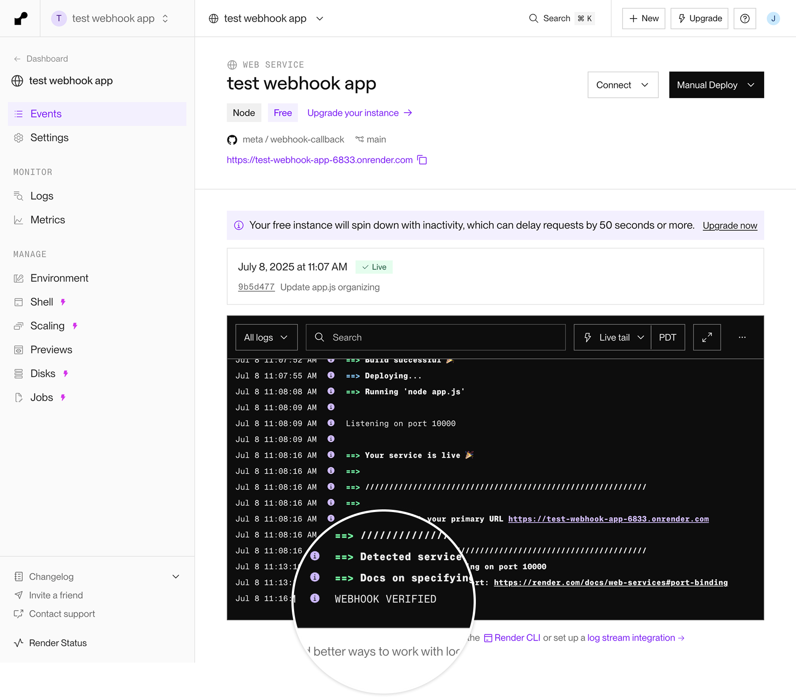
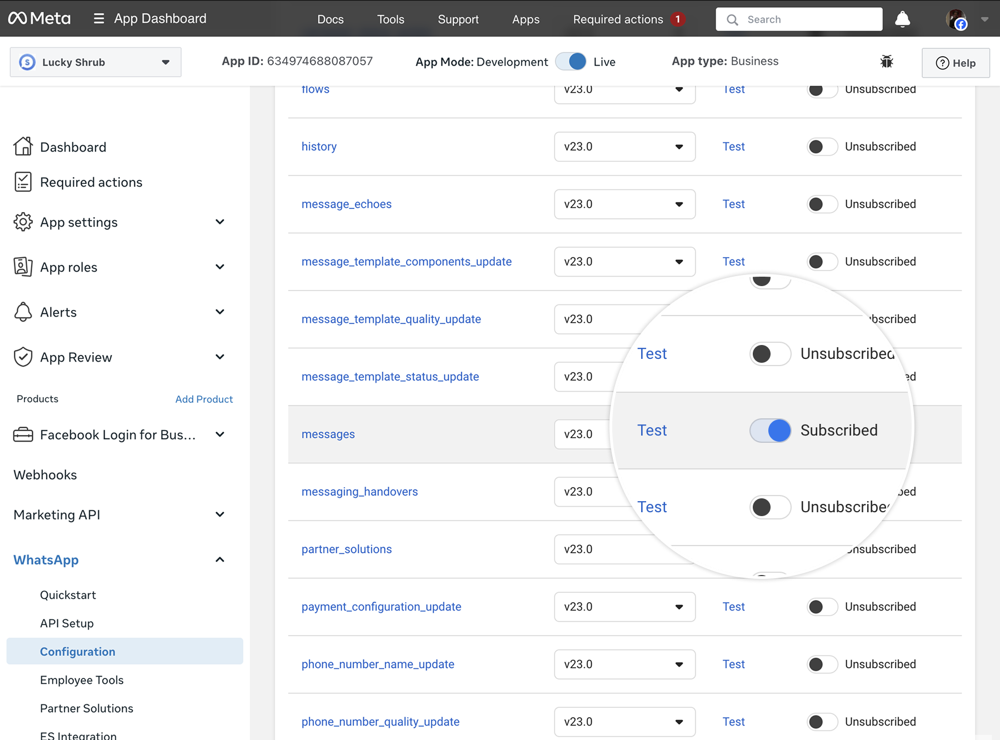
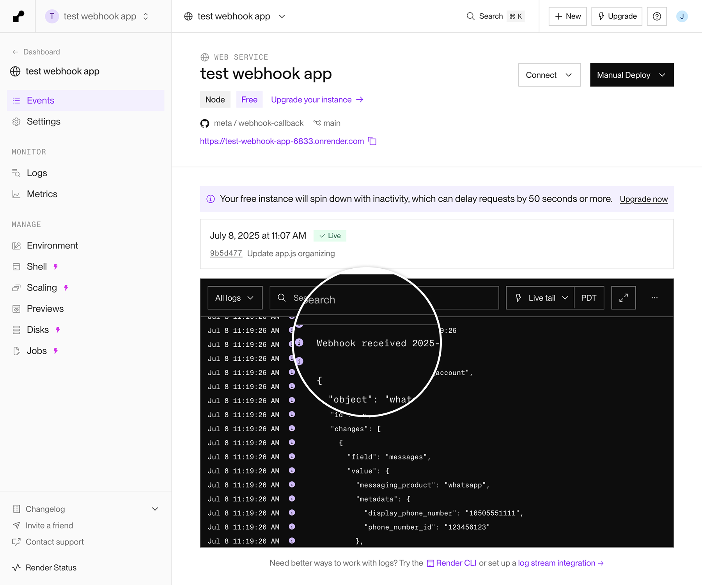

## Summary

A step-by-step guide to deploying a test webhook endpoint using Render and a simple Node.js/Express app. This is for testing purposes only — you must create your own production endpoint before going live. The test endpoint logs webhook payloads to the console for debugging.

## Key Points

- **Testing only**: Not for production use
- **Requirements**: Render account, GitHub account
- **Stack**: Node.js + Express
- **Output**: Console logging of webhook payloads with timestamps

## Setup Steps

### 1. Create GitHub Repository
Create `app.js` with Express server that:
- Handles GET verification (compares `VERIFY_TOKEN` env var)
- Handles POST payloads (logs JSON to console)

### 2. Deploy on Render
- **Build command**: `npm install express`
- **Start command**: `node app.js`
- **Environment variable**: `VERIFY_TOKEN` = your chosen string

### 3. Configure Meta App
Add deployed URL to App Dashboard > WhatsApp > Configuration:

### 4. Verify and Test
- Render log shows "WEBHOOK VERIFIED" on successful verification
- Subscribe to `messages` field
- Send test webhook from dashboard

## Troubleshooting

- Verify URL was added correctly to Meta App
- Confirm subscription to `messages` field
- Test webhooks work in both Dev and Live modes

## Related Concepts
- [webhook-verification](webhook-verification.md)
- [webhooks](webhooks.md)

## Related Entities
- [render-deployment](render-deployment.md)
- [get-verification-request](get-verification-request.md)
